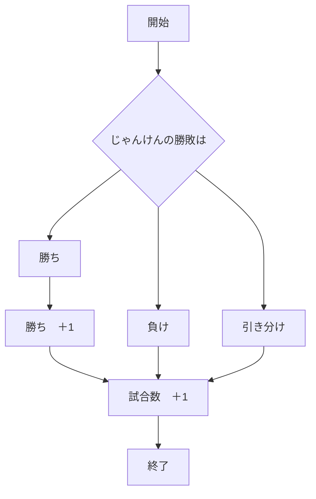
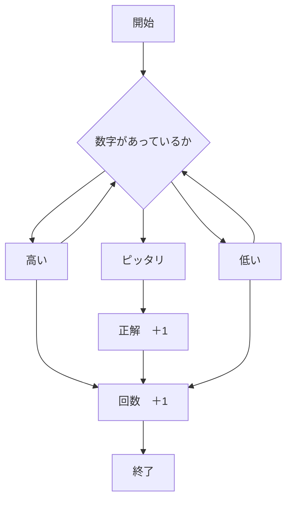
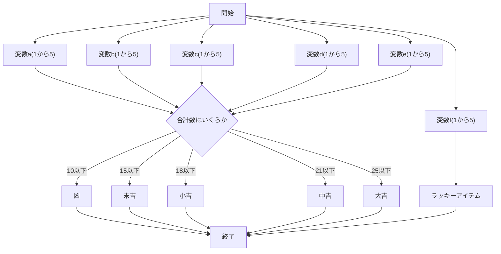

# webpro_06
11月18日
# app5.js
この```app5.js```にはじゃんけんのほか２つの機能を追加した．
1. /janken (じゃんけん)
1. /high (数字当てゲーム)
1. /unn (運勢)

これらのプログラムについて説明を行う．
## １．/janken
### このプログラムについて
このプログラムはランダムでコンピューターがグー，チョキ，パーを出し，自分の手を入力することでじゃんけんができるというプログラムである．また試合数と勝利数を表示し，結果がわかるようになっている．

### このプログラムの概要
1. 変数```num```がランダムに1から３までの数字を出力する．
1. そのランダムに出力される数字に各々変数```cpu```を設定し，それぞれ，グー，チョキ，パーを出力する．
1. ```if```を用いて勝敗の条件を作成する．
  ```hand```は自分の手を表す変数
  ```judgement```はその結果を表す変数
  ```win```は勝利数をカウントする変数
  ```hand == cpu```の場合，```judgement```は引き分けを表す．
  ```(hand == 'グー' && cpu == 'チョキ') ||(hand == 'チョキ' && cpu == 'パー') ||(hand == 'パー' && cpu == 'グー')```の場合，```judgement```は勝ちを表す．
  また変数```win```に1足される．
  それ以外の場合，```judgement```は負けを表す．
1. 変数```total```は試合数を表し，これらが行われるたび1足されていく．


### プログラムの使用方法
1. ``` node app5.js ```でプログラムを起動する
1. Webブラウザで``` localhost:8080/public/janken.html ```にアクセスする
1. 自分の手を入力する

### フローチャート



## ファイル一覧
ファイル名 | 説明
-|-
app5.js | プログラム本体
public/janken.html | じゃんけんの開始画面
views/janken.ejs | じゃんけんのテンプレートファイル

## ２．/high

### このプログラムについて
このプログラムはランダムに1から100までの数字をコンピューターが出力し，その数を予測し，当てるまで繰り返すプログラムである．

### このプログラムの概要
1. 変数```num```がランダムに1から100までの数字を出力する．
1. ```if```を用いて勝敗の条件を作成する．
  ```hand```は自分の手を表す変数
  ```judgement```はその結果を表す変数
  ```good```は勝利数をカウントする変数
  ```cpu == hand```の場合，```judgement```はピッタリを表す．
  また変数```num```がランダムに1から100までの数字を出力する．
  ```cpu > hand```の場合，```judgement```はその数より低いを表す．
  また変数```good```に1足される．
  ```cpu < hand```の場合，```judgement```はその数より高いを表す．
1. 変数```total```は試合数を表し，これらが行われるたび1足されていく．

### プログラムの使用方法
1. ``` node app5.js ```でプログラムを起動する
1. Webブラウザで``` localhost:8080/public/high.html ```にアクセスする
1. 数字を予測し，入力する
1. 数字が当たるまで予測し続ける

### フローチャート



### ファイル一覧
ファイル名 | 説明
-|-
app5.js | プログラム本体
public/high.html | 数字当てゲームの開始画面
views/high.ejs | 数字当てゲームのテンプレートファイル

## ３．/unn
### このプログラムについて
このプログラムは3つの選択肢から1つを選択し，5つの運をそれぞれランダムに1から5までの数字を出力して，その合計値によって運勢を決めるプログラムである．またランダムにラッキーアイテムを表示する．
### このプログラムの概要
1. 変数```a```がランダムに1から5までの数字を出力する．
1. 変数```b```がランダムに1から5までの数字を出力する．
1. 変数```c```がランダムに1から5までの数字を出力する．
1. 変数```d```がランダムに1から5までの数字を出力する．
1. 変数```e```がランダムに1から5までの数字を出力する．
1. 変数```f```がランダムに1から5までの数字を出力する．
1. 変数```f```でランダムに出力される数字に各々変数```cpu```を設定し，ラッキーアイテムを出力する．
1. ```if```を用いて勝敗の条件を作成する．
  ```judgement```はその結果を表す変数
  ```imi```はその運勢にふさわしい言葉を表示する変数
  ```e + a + b + c + d <= 10```の場合，```judgement```は凶を表す．
  ```e + a + b + c + d <= 15```の場合，```judgement```は末吉を表す．
  ```e + a + b + c + d <= 18```の場合，```judgement```は小吉を表す．
  ```e + a + b + c + d <= 21```の場合，```judgement```は中吉を表す．
  ```e + a + b + c + d <= 25```の場合，```judgement```は大吉を表す．

### プログラムの使用方法
1. ``` node app5.js ```でプログラムを起動する
1. Webブラウザで``` localhost:8080/public/unn.html ```にアクセスする
1. 3つの選択肢から1つ選ぶ

### フローチャート



## ファイル一覧
ファイル名 | 説明
-|-
app5.js | プログラム本体
public/unn.html | 運勢の開始画面
views/unn.ejs | 運勢のテンプレートファイル

## 編集したファイルをGitで管理する方法
以下の3つのコマンドを実行する．
```
git add .                      
git commit -am '変更点を入れる'
git push 
```