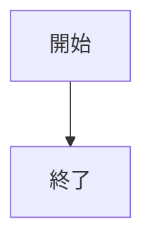
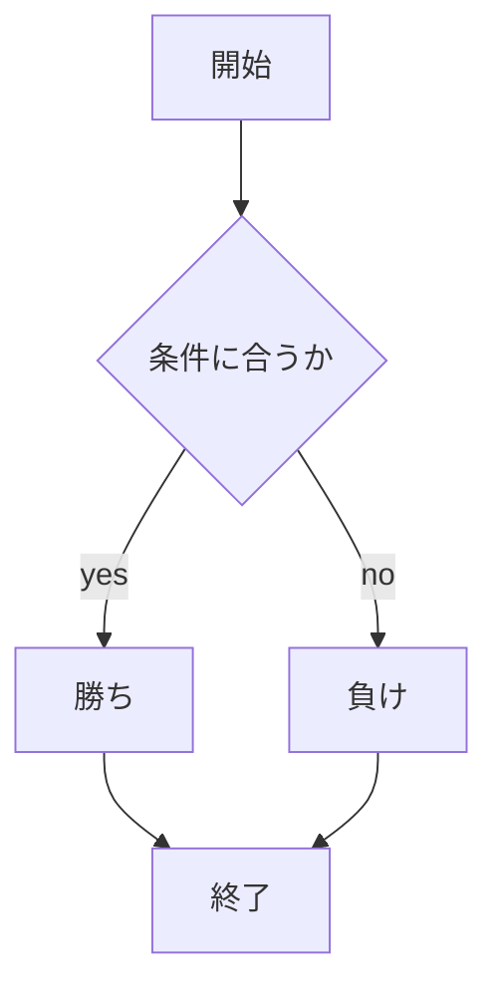

# webpro_06
10月29日

## このプログラムについて

## プログラムの使用方法
1. ``` node app5.js ```でプログラムを起動する
1. Webブラウザで``` localhost:8080/public/janken.html ```にアクセスする
1. 自分の手を入力する

## フローチャート



## ファイル一覧
ファイル名 | 説明
-|-
app5.js | プログラム本体
public/janken.html | じゃんけんの開始画面
views/janken.ejs | じゃんけんのテンプレートファイル

```javascript
console.log( 'Hello' );
```